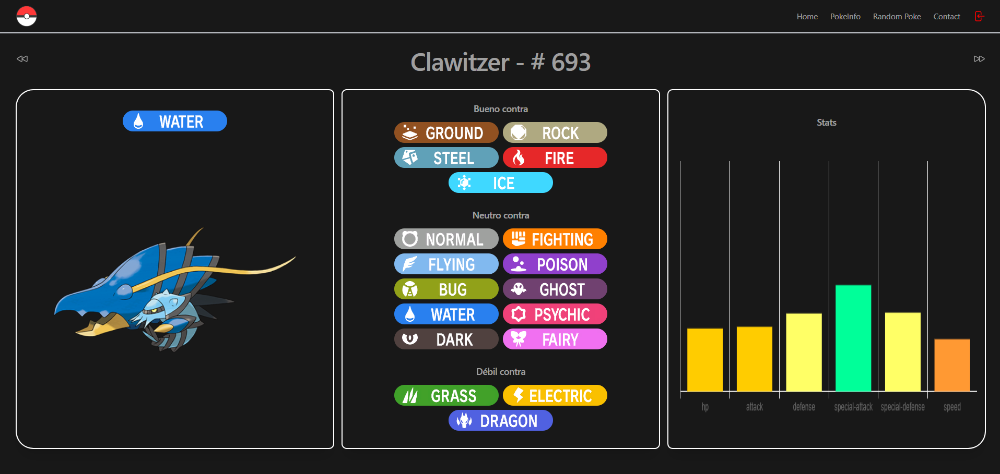

# Pokemon-wiki

Página sencilla que muestra la información de un Pokemón utilizando la api de See [PokeApi](https://pokeapi.co/)

## Tecnologías​ 🛠️

Html

Css

Tailwind

Typescript

Vue3

Visual Studio Code ( Editor recomendado ) ✔️

https://code.visualstudio.com/

## Vista Proyecto

See [Ver Proyecto] (https://pokemonwiki-moloch.netlify.app)



## Customize configuration

See [Vite Configuration Reference](https://vitejs.dev/config/).

## Project Setup

```sh
npm install
```

### Compile and Hot-Reload for Development

```sh
npm run dev
```

### Type-Check, Compile and Minify for Production

```sh
npm run build
```